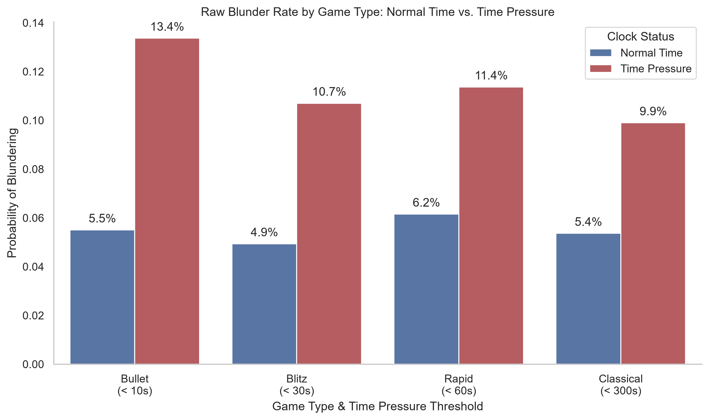
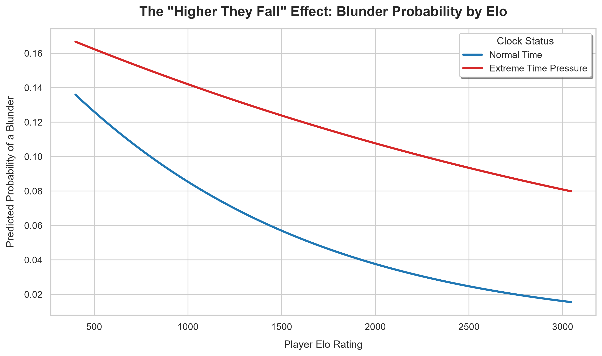

# The Economics behind Time Pressure
### An Econometric Analysis of Decision Degradation (Chess Blunders)

## Executive Summary
This project bridges data engineering and behavioral economics by analyzing how extreme time pressure affects decision-making. Using a custom ETL pipeline to parse raw, compressed Lichess game data, this project engineers a dataset of over 300,000 chess moves. A Logistic Regression model is then applied to quantify the "time-pressure penalty," revealing a counter-intuitive behavioral insight: while highly rated players generally blunder less, their decision-making quality degrades significantly faster under time pressure than that of amateur players.

## Project Highlights

**Data Engineering:** Engineered a custom Python pipeline to parse over 3.5 million raw events, resulting in a clean analytical dataset of 324,000 evaluable decisions.

**Econometric Modeling:** Mapped precise clock times to objective [Stockfish](#glossary) engine evaluations ([Centipawn Loss](#glossary)).

**Statistical Analysis:** Applied logistic regression to calculate the exact probability of a [blunder](#glossary) as time depletes, comparing decision resilience across different Elo skill brackets.

## Tech Stack & Methodologies 
* **Languages:** Python
* **Data Engineering:** `zstandard` (binary decompression), `python-chess` (PGN node parsing), `pandas` (feature engineering)
* **Econometrics:** `statsmodels` (Logistic Regression, Interaction Terms, Odds Ratios)
* **Data Visualization:** `matplotlib`, `seaborn`

## Data Engineering Pipeline (ETL) 
Extracting move-by-move clock data from standard PGN files requires navigating deeply nested tree structures. The pipeline handles this by:
1. **Streaming Decompression:** Utilising `zstandard` to read massive `.zst` files in binary mode, preventing memory overflow.
2. **Node Traversal:** Iterating through `python-chess` game nodes to extract individual ply metrics (Clock Time, Player Elo, Move Evaluation).
3. **Feature Engineering:** 
   * Calculating centipawn loss by lagging Stockfish evaluations (`.shift()`) to isolate move-by-move accuracy.
   * Creating a binary `Blunder` dependent variable (Centipawn loss ≥ 300).
   * Constructing a dynamic `TimePressure` dummy variable adjusted for game format:  
   <10s for Bullet,  
   <30s for Blitz,  
   <60s for Rapid,  
   <300s for Classical.  

**The Universal Penalty of Time Scarcity:**  
Across all time controls, severe clock pressure drives a massive spike in critical errors. While fast-paced formats like Bullet and Blitz naturally exhibit more volatile blunder rates, the relative impact of time pressure diminishes as the baseline game time increases.

## Econometric Modeling & Key Insights
The analysis utilises a Logistic Regression model to test the causal relationship between time pressure and severe errors, controlling for player skill. 

### 1. The Time-Pressure Penalty (Main Effect)
The initial Logit model (`Blunder ~ TimePressure + PlayerElo`) yielded a statistically significant positive coefficient for time pressure ($p < 0.001$). Holding skill constant, players are mathematically proven to be **2.55 times more likely** to make a game-losing blunder when their clock drops below the critical threshold.

### 2. The "Higher They Fall" Effect (Interaction Term)
To test if highly skilled individuals are immune to panic, an interaction term was introduced (`Blunder ~ TimePressure * PlayerElo`). 
* The interaction coefficient was **positive and statistically significant**. 
*  While Grandmasters have a vastly superior baseline of play, stripping away their time removes their primary tool, deep calculation. Consequently, the proportional spike in blunder probability under pressure is mathematically more **severe** for a master than for a beginner relying on intuition.

## Visualizations

## How to Run
1. Clone this repository.
2. Download a standard rated PGN dataset from the [Lichess Database](https://database.lichess.org/).
3. Ensure `python-chess`, `zstandard`, and `statsmodels` are installed (`pip install -r requirements.txt`).
4. Run `python data_pipeline.py` to extract and format the CSV.
5. Run the Jupyter Notebook to view the regression outputs and generate visualizations.

## Glossary

* **Elo:** The standard statistical rating system used to measure a player's relative skill level.
* **Centipawn Loss (CPL):** The mathematical unit used by chess engines to evaluate a position. One centipawn equals one-hundredth of a pawn's value. 
* **Blunder:** A severe error defined objectively in this study as a move resulting in a CPL of 300 or greater.
* **Stockfish:** The open-source AI engine used to generate the objective, baseline evaluations for the dataset.

## Author 
Oluwamuretomiwa Oludoyi   
BSc (Hons), Economics and Econometrics, University of Bristol  
[LinkedIn](https://www.linkedin.com/in/oluwamuretomiwa-oludoyi-0742b0257/)  
[Email](mailto:toludoyi@outlook.com)
